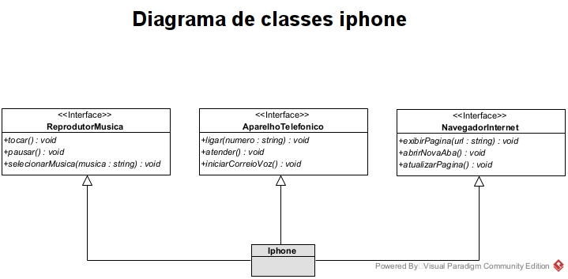

# IPhone UML

Este Lab Project foi desenvolvido com o intuito de exercitar os conhecimentos de programação orientada a objetos, aprendidos no bootcamp DIO santader 2024. Tendo como o base o [Vídeo](https://www.youtube.com/watch?v=9ou608QQRq8&ab_channel=TuchilaRino) de lançamento do iPhone em 2007, foi elaborado na ferramenta Visual Paradigm um diagrama de classes e interfaces UML, com a proposta de representar os papéis do iPhone de: Reprodutor Musical, Aparelho Telefônico e Navegador na Internet. Em seguida foram criadas as classes e interfaces no formato de arquivos java.

## 

## Techs
